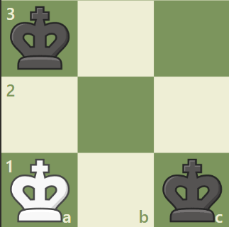
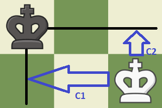
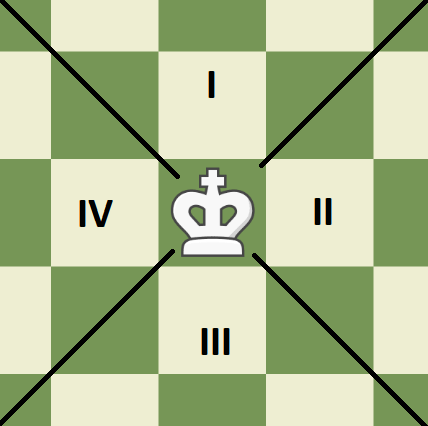
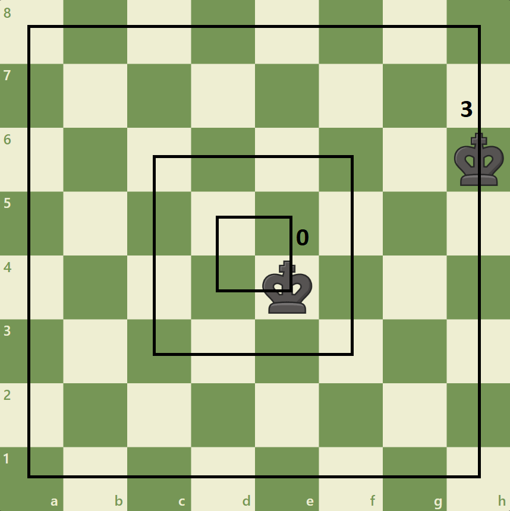
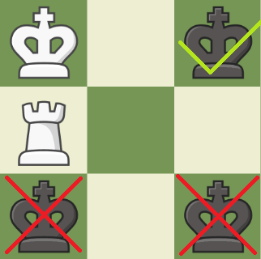

```{r setup, include=FALSE}
knitr::opts_chunk$set(echo = TRUE)
# library(dplyr)
library(rpart)
library(caret)
library(dplyr)
library(knitr)
```

# Introduction

In this project, I am going to analyze a data set "Chess (King-Rook vs.
King)" from UCI Machine Learning Repository. It contains coordinates of
three pieces on a chessboard: white king, white rook and black king and
optimal depth-of-win for White in 0 to 16 moves, otherwise drawn,
assuming that Black moves first. Due to its nature, the data set does
not contain any missing values. <br> The goal is to predict the number
of moves, based on a position on a chessboard. Let's see the header of
the data. The name of the columns are coded using three letters: the
first one - <b>w</b>hite or <b>b</b>lack, the second - <b>K</b>ing or
<b>R</b>ook, the third <b>c</b>olumn of <b>f</b>ile

```{r}
set.seed(1234)
ends=read.table('krkopt.data',sep=',',header=FALSE)
names(ends)=c('wKf','wKc','wRf','wRc','bKf','bKc','Result')
head(ends)
```

For example, the first position in the set is as follows:<br>
<br>
It is a draw, because the Black King can capture the Rook in the first
move. An example of mate in 0 would be <br>
<br>
Here, the bK (Black King) has no legal moves and it is checked by wR
(White Rook). <br> We suspect that the number of observations varies
within each value of Result

```{r}

summary(as.factor(ends$Result))
```

As seen, there is only 27 positions resulting in instantaneous mate and
4553 positions with mate in the thirteenth move.

How many positions with these three pieces are actually possible? It is
easy to estimate. There are 64 squares on the board. We place wK in one
of 64 squares. Then, we place wR on one of remaining 63 squares. bK can
be placed anywhere further than one square to wK. Let's assume that it
leaves 56 squares for bK. In total there are around 214 000 positions
like that. Let's compare it with the data set

```{r}
print(nrow(ends))
```

The number of positions in the set is much lower. We can suspect that
trivial positions are eliminated. For example, we can eliminate 75% of
original positions by realizing that positions are unique with the
respect to a rotation of the chess board. This leaves us with around
53000 positions but the set contains only half of that. It is possible
that some positions with a similar wR positions were not included.

```{r}
print(unique(ends$wKf))
print(unique(ends$wKc))
```

As seen, only positions with wK on one quarter of the board are in the
data set.<br> Let's further see if all possible combinations of
positions of wK and bK are in the data set.

```{r}
nrow(ends[!duplicated(ends[,1:4]), ])
```

It is less then predicted 1083. It means that also symmetrical positions
have been eliminated. For example, no matter where bK stands, these
positions would be the same:<br>
<br>
Indeed, there is no positions with bK on file a, when wK is in the
corner.

```{r}
ends[ends$wKf=='a' & ends$wKc==1 & ends$bKf=='a',]
```

# Prediction

## Trivial model

Since chess is a game of perfect information, there is no model
necessary to predict the outcome of the game. Given this data set, one
can predict the outcome of any position with 100% accuracy, because this
position is already included in this data set. <br> Thus, let us reduce
the size of the set by 50% and try to train some model to predict the
results in the other half. Also, since both files and columns mean
coordinates, I will change letters "a", "b", "c"... to numbers.
Sometimes it will be easier for us to think about coordinates as numbers
and sometimes they are more meaningful as factors, so I will design a
function changing the type of those variables automatically.

```{r}
#test set
sample_test=sort(sample(1:nrow(ends), nrow(ends)/2))
#complement of testing set
sample_ntest=sort(setdiff(1:nrow(ends),sample_test))
#validation set
sample_vd=sort(sample(sample_ntest, 0.25*length(sample_ntest)))
#training set
sample_train=sort(setdiff(sample_ntest,sample_vd))

files=c("a","b","c","d","e","f","g","h")
for(i in 1:8){
  ends[ends$wKf==files[i],1]=i
  ends[ends$wRf==files[i],3]=i
  ends[ends$bKf==files[i],5]=i
}
ends$wKf=as.integer(ends$wKf)
ends$wRf=as.integer(ends$wRf)
ends$bKf=as.integer(ends$bKf)
ends$Result=as.factor(ends$Result)

change_coordinates_to=function(x, to, exeptions){
  if(to=='numeric'){
    for(i in 1:ncol(x)) if(!i %in% exeptions) x[,i]=as.integer(as.character(x[,i]))
    return(x)
  }
    if(to=='factor'){
    for(i in 1:ncol(x)) if(!i %in% exeptions) x[,i]=as.factor(x[,i])
    return(x)
  }
}

```

## Problem description

The problem is a mixed classification-regression problem. Classification
includes categories: 'draw' or 'white wins'. Regression is predicting
the number of necessary moves.

## Model 1

Since mixed problems are in general more complicated than regression or
classification, let us first try to treat the problem as classification
problem with eighteen categories: draw, zero,...,sixteen. We will start
by changing the order of levels in Result variable, from alphabetical to
numerical. We introduce zero-one loss, used to train the optimal model
by investigating generalization error. Then we look for optimal tree
parameters. We expect that each leaf can possibly contain only a few
observations, because even a change of king's position by one square can
have huge consequences.

```{r}
# new_order_data <- factor(factor_data,levels = c("East","West","North"))
ends$Result=factor(ends$Result,levels=c("draw","zero","one","two","three","four","five", "six","seven", "eight","nine","ten","eleven","twelve","thirteen","fourteen","fifteen","sixteen"))

one_zero_loss=function(fit,test_set){
  categories=colnames(predict(fit,test_set))
  sum=0
  for(i in 1:length(categories)) sum=sum+sum(test_set$Result==categories[i] & predict(fit,test_set,type='vector')!=i)
  return(sum/nrow(test_set))
}

ends_train=ends[sample_train,]
ends_train=change_coordinates_to(ends_train,'factor',7)
ends_vd=ends[sample_vd,]
ends_vd=change_coordinates_to(ends_vd,'factor',7)
best_i=1
best_one_zero_error=1
one_zero_error=c()
i=1
for(i in 1:5){
  fit <- rpart(Result~wKc+wKf+bKc+bKf+wRc+wRf
               , data = ends_train, parms = list( split = "gini"),control=list(minsplit=1,minbucket=i,cp=0))
  one_zero_error[i]=one_zero_loss(fit,ends_vd)
  if(one_zero_error[i]<=best_one_zero_error){
    best_i=i
    best_one_zero_error=one_zero_error[i]
  }
}
plot(1:5,one_zero_error,type='l',xlab='Minimal size of a bucket',ylab='Expected generalization error')
print(best_one_zero_error)
```

As seen, the model error is estimated to be 0.3384659 for optimal tree
shape. Let's take a look at a confusion matrix.

```{r}
  fit <- rpart(Result~wKc+wKf+bKc+bKf+wRc+wRf , data = ends_train, parms = list( split = "gini"),control=list(minsplit=1,minbucket=1,cp=0))
true_val=as.factor(ends_vd$Result)
lev=colnames(predict(fit,ends_vd))
true_lev=levels(true_val)
prediction=predict(fit,ends_vd,'vector')
prediction2=c()
for(i in 1:length(prediction)){
  prediction2[i]=lev[prediction[i]]
}
prediction2=as.factor(prediction2)
prediction2=factor(prediction2,levels=c("draw","zero","one","two","three","four","five", "six","seven", "eight","nine","ten","eleven","twelve","thirteen","fourteen","fifteen","sixteen" ))
conf=confusionMatrix(
  true_val,
  as.factor(prediction2))
print(conf$table)
```
The model is not doing bad, but I am sure that it's possible to significantly improve its performance by creating additional variables, implementing basic chess concepts.

## Model 2
### Concept 1: Capturing White Rook
There are only possible options to draw this game: in the first move Black King is steal-mated or in the first move Black King can capture White Rook. It is simple in terms of coordinates: bK in next to wR and wK is not next to wR. We introduce two new boolean variables: bKwR if bK is close enough to capture wR and wKwR if wK is close enough to defend it. 

```{r}
ends['bKwR']=0
ends['wKwR']=0
for(i in 1:nrow(ends)){
  if((abs(ends$wRf[i]-ends$wKf[i])<=1 & abs(ends$wRc[i]-ends$wKc[i])<=1)) ends$wKwR[i]=1
  if((abs(ends$wRf[i]-ends$bKf[i])<=1 & abs(ends$wRc[i]-ends$bKc[i])<=1)) ends$bKwR[i]=1
} 
```
### Concept 3: Relative position of Kings
We will carefully describe the relative position of the kings. We can start simple with introducing the distance between them, dKK. Before we do it, we introduce a new coordinate system to measure the position of bK. In this system, bK position is measured relatively to wK.
<br><br>
```{r}
#wK-centered distance to bK
ends=mutate(ends,dC1=bKf-wKf)
ends=mutate(ends,dC2=bKc-wKc)

#how far apart are kings?
ends=mutate(ends,dKK=max(abs(dC1),abs(dC2)))
ends$dKK=apply(abs(cbind(ends$dC1,ends$dC2)),1,max)
```
Now let us introduce a more complex idea. It is not possible to mate the Black King without pushing it to the border of the chessboard. It means that the distance between the Kings can be misleading: sometimes kings can start the game close to one another, but bK needs to push wK to the opposite side of the board. We can suspect that the border where bK will eventually get mated, depends on relative position of the kings:
<br><br>
If bK is in the first quarter (variable q), it will probably get mated next to the upper border (rank 8). If it is in the second quarter, it should get mated on the 'a' file, etc.
We will measure bK distance from those borders (variable bKborder)
```{r}
#which quarter is bK in
ends$q=0
for(i in 1:nrow(ends)){
  if(ends[i,11]>0 & ends[i,10]<=ends[i,11] & -ends[i,10]<ends[i,11]) ends[i,13]=1
  if(ends[i,10]>0 & ends[i,10]>ends[i,11] & ends[i,10]>=-ends[i,11]) ends[i,13]=2
  if(ends[i,11]<0 & ends[i,10]<=-ends[i,11] & ends[i,10]>ends[i,11]) ends[i,13]=3
  if(ends[i,10]<0 & -ends[i,10]>ends[i,11] & ends[i,10]<=ends[i,11]) ends[i,13]=4
}

#what is the distance of bK to 'mating' border
ends$bKborder=((ends$q==1)*(8-ends$bKc)+(ends$q==2)*(8-ends$bKf)+(ends$q==3)*(ends$bKc-1)+(ends$q==4)*(ends$bKf-1))
```

Each border has two corners. Let's measure kings' distance to the closer and further of them.
```{r}
#auxilary functions
rmin=function(x,y) apply(cbind(x,y),1,min)
rmax=function(x,y) apply(cbind(x,y),1,max)

#what is the distance of bK to all corners
ends$dbKcorn1=rmax((8-ends$bKf),(8-ends$bKc))
ends$dbKcorn2=rmax((8-ends$bKf),(ends$bKc-1))
ends$dbKcorn3=rmax((ends$bKf-1),(ends$bKc-1))
ends$dbKcorn4=rmax((ends$bKf-1),(8-ends$bKc))

#what is the distance from bK to 'his' corners
ends$dbKcMIN=
  (ends$q==1)*rmin(ends$dbKcorn4,ends$dbKcorn1)+
  (ends$q==2)*rmin(ends$dbKcorn1,ends$dbKcorn2)+
  (ends$q==3)*rmin(ends$dbKcorn2,ends$dbKcorn3)+
  (ends$q==3)*rmin(ends$dbKcorn3,ends$dbKcorn4)
              
ends$dbKcMAX=
  (ends$q==1)*rmax(ends$dbKcorn4,ends$dbKcorn1)+
  (ends$q==2)*rmax(ends$dbKcorn1,ends$dbKcorn2)+
  (ends$q==3)*rmax(ends$dbKcorn2,ends$dbKcorn3)+
  (ends$q==3)*rmax(ends$dbKcorn3,ends$dbKcorn4)

#deleting corners
ends=select(ends,-c(dbKcorn1,dbKcorn2,dbKcorn3,dbKcorn4))
```
### Concept 4: More information about Black King
Let's also try to record if bK starts in the corner, what can possibly lead to a stalemate. Finally we introduce bKlayer: how 'deep' in the chessboard the king starts.
<br><br>
```{r}
#is bK in the corner
ends['bKcor']=0
for(i in 1:nrow(ends)) if(ends$bKc[i] %in% c(1,8) && ends$bKf[i] %in% c(1,8)) ends$bKcor[i]=1

#bK layer
ends$bKLayer=min(floor(abs(ends$bKc-4.5)),floor(abs(ends$bKf-4.5)))
```

### Concept 5: Rook and Black King
Let's see if 1) Rook is checking the Black King 2) Rook limits bK moves away from where its going to get mated.
```{r}
#is it check?
ends['check']=0
for(i in 1:nrow(ends)) if((!(ends$wKf[i] %in% (ends$wRf[i]:ends$bKf[i])) | ends$wKc[i]!=ends$bKc[i]) & ends$wRc[i]==ends$bKc[i]) ends$check[i]=1
for(i in 1:nrow(ends)) if((!(ends$wKc[i] %in% (ends$wRc[i]:ends$bKc[i])) | ends$wKf[i]!=ends$bKf[i]) & ends$wRf[i]==ends$bKf[i]) ends$check[i]=1

#does rook limit king's moves in 'his' direction
ends$Rlimits=ends$dbKcMIN=(ends$q==1)*(ends$bKc-ends$wRc==1)+
  (ends$q==2)*(ends$bKf-ends$wRf==1)+
  (ends$q==3)*(ends$bKc-ends$wRc==-1)+
  (ends$q==3)*(ends$bKf-ends$wRf==-1)


```

### Concept 6: Opposition
Final important concept is an opposition, position in which two kings face each other on a rank or file, with only one square between them. The picture shows two positions without opposition and one with.
<br><br>
The variable opp is 0 when there is no opposition in starting position.
```{r}
ends['opp']=0
ends$opp=
  (ends$dKK==2 & (
    (ends$wKf==ends$bKf & !(ends$wRf==ends$bKf & ends$wKwR==1 & ends$check==1)) | ends$wKc==ends$bKc & !(ends$wRc==ends$bKc & ends$wKwR==1 & ends$check==1)))*1
```
### Fitting the model
Now, once we coded these chess concepts, let's see how much do they improve our model.
```{r,echo=FALSE}
ends=change_coordinates_to(ends,'factor',7)

ends_train=ends[sample_train,]
ends_vd=ends[sample_vd,]
best_i=1
best_one_zero_error=1
one_zero_error=c()
i=1
for(i in 1:5){
  fit <- rpart(Result~.
               , data = ends_train, parms = list( split = "gini"),control=list(minsplit=1,minbucket=i,cp=0))
  one_zero_error[i]=one_zero_loss(fit,ends_vd)
  if(one_zero_error[i]<best_one_zero_error){
    best_i=i
    best_one_zero_error=one_zero_error[i]
  }
}
plot(1:5,one_zero_error,type='l',xlab='Minimal size of a bucket',ylab='Expected generalization error')
```

The model achieves accuracy of 73%. We will try to improve if slightly more. We have enough knowledge now to code 'draw' and 'mate in 0' as independent variables, as results of our previous analysis.
```{r,echo=FALSE}
ends=change_coordinates_to(ends,'numeric',7)
ends['RC']=0
ends['RC']=ends$bKwR*(1-ends$wKwR)
ends['SM']=0
ends$SM=(ends$bKc==1)*(ends$bKf==1)*((ends$wKc==1)*(ends$wKf==3)*(ends$wRc==2)*(ends$wRf!=1) | (ends$wRc==2)*(ends$wRf==2)*(ends$wKwR==1))

ends['draw']=0
ends$draw=(ends$RC | ends$SM)
ends$draw=ends$draw*1
ends['mate']=0
ends$mate=((ends$bKborder==0)*(ends$opp==1)*(ends$check==1)*(ends$bKwR==0)
 | (ends$bKcor==1)*(ends$dKK==2)*(ends$wRf==1)*(ends$bKwR==0)*(ends$wKc==2))
ends$mate=ends$mate*1

```
### Model comparison
Finally, let's evaluate different models we have trained so far.
```{r,echo=FALSE}
plot_points=c()
ends=change_coordinates_to(ends,'factor',7)

#1 model
ends1=select(ends,wKf,wKc,wRf,wRc,bKc,bKf,Result)
ends_train=ends1[sample_train,]
ends_vd=ends1[sample_vd,]
fit <- rpart(Result~.
               , data = ends_train, parms = list( split = "gini"),control=list(minsplit=1,minbucket=1,cp=0))
plot_points=append(plot_points,one_zero_loss(fit,ends_vd))

#1 model with information criterion
ends1=select(ends,wKf,wKc,wRf,wRc,bKc,bKf,Result)
ends_train=ends1[sample_train,]
ends_vd=ends1[sample_vd,]
fit <- rpart(Result~.
               , data = ends_train, parms = list( split = "information"),control=list(minsplit=1,minbucket=1,cp=0))
plot_points=append(plot_points,one_zero_loss(fit,ends_vd))

#2 model with all variables
ends1=ends
ends_train=ends1[sample_train,]
ends_vd=ends1[sample_vd,]
fit <- rpart(Result~.
               , data = ends_train, parms = list( split = "information"),control=list(minsplit=1,minbucket=1,cp=0))
plot_points=append(plot_points,one_zero_loss(fit,ends_vd))

#2 model with draw and mate
ends1=select(ends,wKf,wKc,wRf,wRc,bKc,bKf,Result,draw,mate)
ends_train=ends1[sample_train,]
ends_vd=ends1[sample_vd,]
fit <- rpart(Result~.
               , data = ends_train, parms = list( split = "information"),control=list(minsplit=1,minbucket=1,cp=0))
plot_points=append(plot_points,one_zero_loss(fit,ends_vd))

#2 no black king position - only relative
ends2=select(ends,wKf,wKc,wRf,wRc,dC1,dC2,Result,draw,mate)
ends_train=ends2[sample_train,]
ends_vd=ends2[sample_vd,]
fit <- rpart(Result~.
               , data = ends_train, parms = list( split = "information"),control=list(minsplit=1,minbucket=1,cp=0))
plot_points=append(plot_points,one_zero_loss(fit,ends_vd))

#variables as continous, not factors
ends3=change_coordinates_to(ends,'numeric',7)
fit <- rpart(Result~.
               , data = ends_train, parms = list( split = "information"),control=list(minsplit=1,minbucket=1,cp=0))
plot_points=append(plot_points,one_zero_loss(fit,ends_vd))
df=data.frame(matrix(c('Coordinates ','Coordinates','All - factors','Draw & mate','Relative bK','All - continous',plot_points,'Gini',rep('Information',times=5)),ncol=3))
colnames(df)=c('Variables','Risk','Splitting')
df$Risk=as.numeric(df$Risk)
```

```{r,echo=FALSE}
plot=ggplot(data=df, aes(x=Variables, y=Risk,fill=Splitting))
col=c("#eeedd5","#7c945c")
for(i in 1:7)
  for(j in 0:4){
    cc=col[(i+j)%%2+1]
    plot=plot+geom_rect(xmin = i-1,    xmax = i, ymin = 0.1*(j-1), ymax = 0.1*j,   fill =cc)
  }
plot=plot+geom_bar(stat="identity",col='black',width=.7)+scale_fill_manual(values = c('white','#585351'))+ggtitle('Comparison of expected generalization risks of different models')
print(plot)
```
<br>As the plot indicates, Information criterion is doing better than Gini. Treating variables as factors is better than treating them as numeric variables. Model with all variables is better than model with only pieces' coordinates. The best model is the one with pieces coordinates' and variables indicating whether its draw or mate. Relative Black King position is less informative than its position independent of White King.

## Using the best model to predict new games
Prediction of chess games is not an usual task for decision tree. As seen, uncommon models with minimal size of a bucket equal to one were doing the best. Thus, we don't expect model to be overfitting. So, we will use training and validation samples to train the best model and see how good it is in predicting compeletly new games from testing set.
```{r,echo=FALSE}
ends_train=rbind(ends[sample_train,],ends[sample_vd,])
ends_train=change_coordinates_to(ends_train,'factor',7)
ends_vd=ends[sample_test,]
ends_vd=change_coordinates_to(ends_vd,'factor',7)
fit <- rpart(Result~.
               , data = ends_train, parms = list( split = "information"),control=list(minsplit=1,minbucket=1,cp=0))
true_val=as.factor(ends_vd$Result)
lev=colnames(predict(fit,ends_vd))
true_lev=levels(true_val)
prediction=predict(fit,ends_vd,'vector')
prediction2=c()
for(i in 1:length(prediction)){
  prediction2[i]=lev[prediction[i]]
}
prediction2=as.factor(prediction2)
prediction2=factor(prediction2,levels=c("draw","zero","one","two","three","four","five", "six","seven", "eight","nine","ten","eleven","twelve","thirteen","fourteen","fifteen","sixteen" ))
conf=confusionMatrix(
  true_val,
  as.factor(prediction2))
kable(conf$table)
```

```{r,echo=FALSE}
table=conf$table
df=data.frame(matrix(nrow=0,ncol=2))
names(df)=c('Result','Prediction')
levels=c("draw","zero","one","two","three","four","five", "six","seven", "eight","nine","ten","eleven","twelve","thirteen","fourteen","fifteen","sixteen" )
for(i in 1:18)
  for(j in 1:18)
    for(k in 1:table[i,j]){
      if(table[i,j]!=0){
              de<-data.frame(j-2,i-2+rnorm(1,0,0.2))
      names(de)<-c("Result","Prediction")
      df=rbind(df,de)
      }
    }
for(i in 1:500){
      de<-data.frame(0,0+rnorm(1,0,0.2))
      names(de)<-c("Result","Prediction")
      df=rbind(df,de)
}

ggplot(df, aes(factor(Result), Prediction))+geom_violin(fill='#7c945c')+ggtitle('Final prediction of games')+labs(caption='-1 means a draw')+xlab('True result')+ylab('Predicted result distribution')+theme(panel.background = element_rect(fill='#eeedd5'))+ scale_y_continuous(breaks = seq(0, 16, len = 9))

```

Final model accuracy in predicting new games is 79%. Additionally, the model's errors are logical - the model is usually off by at most one or two moves. 


